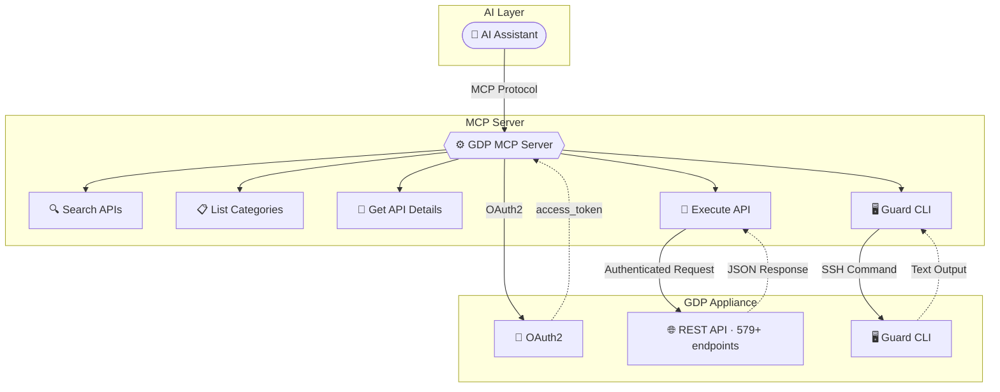
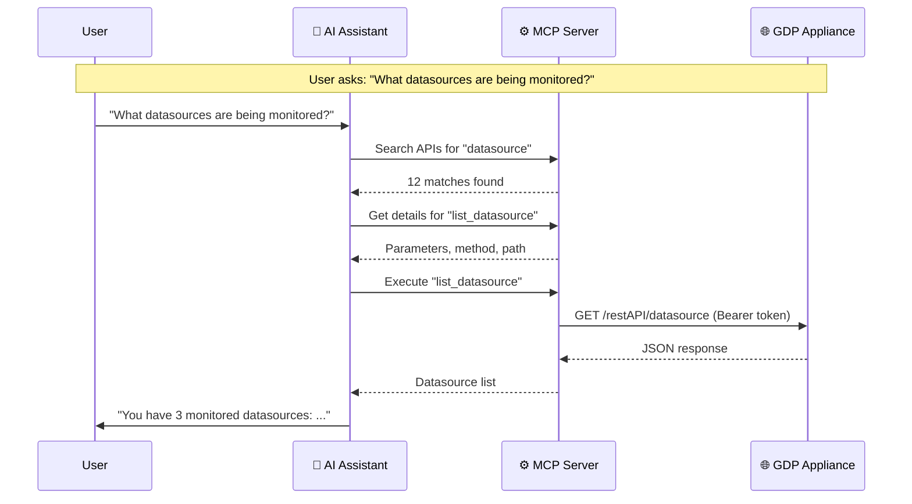
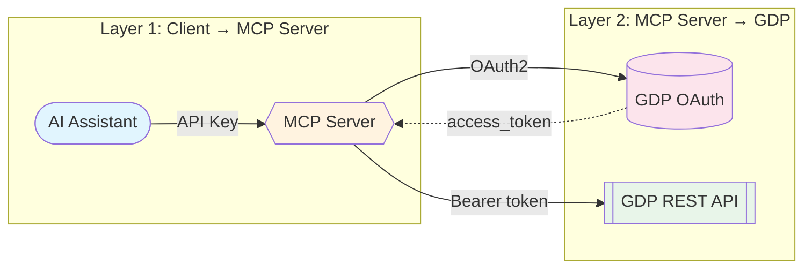

# GDP MCP Server

Let AI agents monitor database activity, enforce security policies, run compliance reports, and manage your entire Guardium deployment through natural language.

## What You Can Do

- **Run compliance reports on demand** — generate SOX, GDPR, or PCI-DSS compliance assessments across all monitored databases in seconds
- **Investigate database activity** — ask "who accessed the payroll database last week?" and get instant answers from Guardium's monitoring data
- **Manage security policies at scale** — review, update, and enforce data protection policies across multiple Guardium appliances from one conversation
- **Monitor S-TAP and system health** — check inspection engine status, disk usage, memory, and connectivity across your entire Guardium deployment

## Compatible With

IBM Bob · Claude Desktop · VS Code Copilot · watsonx Orchestrate · Any MCP-compatible AI assistant

---

## Architecture

```mermaid
%%{init: {'theme': 'default'}}%%
flowchart TB
    subgraph "AI Layer"
        A(["🤖 AI Assistant"])
    end

    subgraph "MCP Server"
        B{{"⚙️ GDP MCP Server"}}
        T1["🔍 Search APIs"]
        T2["📋 List Categories"]
        T3["📄 Get API Details"]
        T4["🚀 Execute API"]
        T5["🖥️ Guard CLI"]
    end

    subgraph "GDP Appliance"
        AUTH["🔐 OAuth2"]
        API["🌐 REST API · 579+ endpoints"]
        CLI["🖥️ Guard CLI"]
    end

    A -->|"MCP Protocol"| B
    B --> T1 & T2 & T3 & T4
    B --> T5
    T4 -->|"Authenticated Request"| API
    T5 -->|"SSH Command"| CLI
    B -->|"OAuth2"| AUTH
    AUTH -.->|"access_token"| B
    API -.->|"JSON Response"| T4
    CLI -.->|"Text Output"| T5
```

## How the AI Navigates 579 Endpoints

```mermaid
%%{init: {'theme': 'default'}}%%
sequenceDiagram
    participant User
    participant AI as 🤖 AI Assistant
    participant MCP as ⚙️ MCP Server
    participant GDP as 🌐 GDP Appliance

    Note over User,GDP: User asks: "What datasources are being monitored?"

    User->>AI: "What datasources are being monitored?"
    AI->>MCP: Search APIs for "datasource"
    MCP-->>AI: 12 matches found
    AI->>MCP: Get details for "list_datasource"
    MCP-->>AI: Parameters, method, path
    AI->>MCP: Execute "list_datasource"
    MCP->>GDP: GET /restAPI/datasource (Bearer token)
    GDP-->>MCP: JSON response
    MCP-->>AI: Datasource list
    AI->>User: "You have 3 monitored datasources: ..."
```

## Security

```mermaid
%%{init: {'theme': 'default'}}%%
flowchart LR
    subgraph "Layer 1: Client → MCP Server"
        A(["AI Assistant"]) -->|"API Key"| B{{"MCP Server"}}
    end

    subgraph "Layer 2: MCP Server → GDP"
        B -->|"OAuth2"| C[("GDP OAuth")]
        C -.->|"access_token"| B
        B -->|"Bearer token"| D[["GDP REST API"]]
    end

    style A fill:#e1f5fe
    style B fill:#fff3e0
    style C fill:#fce4ec
    style D fill:#e8f5e9
```

---

## Contact

**Maintainer:** Anuj Shrivastava — AI Engineer, US Industry Market - Service Engineering

📧 [ashrivastava@ibm.com](mailto:ashrivastava@ibm.com)

For demos, integration help, or collaboration — reach out via email.

> **Disclaimer:** This is a Minimum Viable Product (MVP) for testing and demonstration purposes only. Not for production use. No warranty or support guarantees.

## IBM Public Repository Disclosure

All content in this repository including code has been provided by IBM under the associated open source software license and IBM is under no obligation to provide enhancements, updates, or support. IBM developers produced this code as an open source project (not as an IBM product), and IBM makes no assertions as to the level of quality nor security, and will not be maintaining this code going forward.
