# GDP MCP Server

```mermaid
%%{init: {'theme': 'default'}}%%
flowchart TB
    A(["🤖 AI Assistant"])
    B{{"⚙️ MCP Server"}}
    C[("🔐 GDP OAuth :8443")]
    D[["🌐 GDP REST API"]]

    A -->|"① API Key (Bearer header)"| B
    B -->|"② Validate API Key"| B
    B -->|"③ POST /oauth/token"| C
    C -.->|"④ access_token"| B
    B -->|"⑤ API Call + Bearer Token"| D
    D -.->|"⑥ JSON Response"| B
    B -.->|"⑦ AI Response"| A
```

---

## Contact

**Maintainer:** Anuj Shrivastava — IBM Security

📧 [ashrivastava@ibm.com](mailto:ashrivastava@ibm.com)

For demos, integration help, or collaboration — open a [GitHub Issue](https://github.com/IBM/gdp-mcp-server/issues) or reach out via email.

---

## IBM Public Repository Disclosure

All content in this repository including code has been provided by IBM under the associated open source software license and IBM is under no obligation to provide enhancements, updates, or support. IBM developers produced this code as an open source project (not as an IBM product), and IBM makes no assertions as to the level of quality nor security, and will not be maintaining this code going forward.

> **Disclaimer:** MVP for testing and demonstration only. Not for production use.
